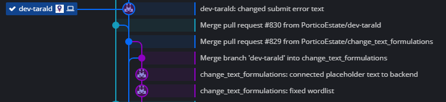

= Aktiv Kommune
:toc: macro
:toc-title: Innhold

For Frontend-Utviklere

toc::[]

== Kort Innføring i systemet/prosjektet:

Systemet er i hovedsak et bookingsystem, der innbyggere/idrettslag osv kan booke kommunale ressurser. Hver ressurs inneholder beskrivelse av ressursen, bilder, spesifikasjoner av utstyr m.m. Hver ressurs har også en egen kalender som viser når ressursen er tilgjengelig og utilgjengelig. Her kan en også se hvem som er leier en ressurs på et spesifikt tidspunkt og hva det gjelder, dersom det ikke er satt som privat.

Koden finner du på Github: https://github.com/PorticoEstate/PorticoEstate[_https://github.com/PorticoEstate/PorticoEstate_]

Du som frontend utvikler, vil motta oppgaver/ønske om endringer via Teamworks. Arbeidet planlegges og gjennomføres ved hjelp av SCRUM metoden, noe som hjelper til å få oversiktlig og konkrete arbeidsoppgaver som utføres over en 2-ukers sprint periode.

Systemet er basert på et modulbasert web-grensesnitt som heter Portico Estate. Dette er utviklet av Bergen Kommune, og Sigurd Ness er den som har stål-kontroll på systemet. Som Frontend utvikler, vil du hovedsakelig jobbe på XSL filer (dette er template filer med HTML kode), CSS og JavaScript (blanding av vanilla JS og jQuery, som på sikt fases ut)

== Utvikling:

Utvikling skjer hovedsakelig på lokale miljøer, der du har en egen dev-branch i GitHub som du jobber mot. Anbefalingen er å lage egne brancher basert på dev-branchen, og merge inn endringene før desse merges inn i Master for testing før release mot produksjon.

Utviklermiljøene anbefales å settes opp på et virtuelt miljø sentralt i kommunen, men kan også kjøres lokalt på egen datamaskin. Der ligger et eget dokument som tar for seg oppsett av utviklermiljø. Grunnen til at det anbefales å sette opp miljøet sentralt istedenfor lokalt er der er enklere å vedlikeholde en separat server enn å kjøre ting lokalt. En har også lavere risiko for feil som oftest når det ligger i sentralt VM miljø, da lokale installasjoner ofte kan få feil/bugs. En kan også jobbe fra ulike arbeidsstasjoner/hjemme uten å være avhengig av at arbeidsstasjonen er påskrudd.

Kodeeditor er strengt tatt valgfritt, men det anbefales å bruke NetBeans eller Visual Studio Code. Oppsett for utviklermiljøet baserer seg på bruk av Visual Studio Code.

== Branching og Merging

Der er per i dag ingen definitiv standard på branching og commits. Men best practice er at en lager en feature branch basert på dev-branch når en arbeider med en spesifik oppgave.

Det anbefales at en bruker et CLI program for å gi branch navn til commit meldingene. Et eksempel på en slik CLI:

https://www.npmjs.com/package/@sanderhelleso/cit[_https://www.npmjs.com/package/@sanderhelleso/cit_]

(Må installeres lokalt på maskinen via NPM)

Eller en kan skrive det inn manuelt. Igjen, det er ikke et krav per i dag, men er greit for å ha god kontroll og oversikt. Se bilde for hvordan commits vil se ut i oversikten da, der branchen change_text_formulations går på endring av tekst formuleringer (oppdrag fra teamworks) med commit meldingen om hva som ble gjort etter.

== Mappestruktur:

Mappestrukturen er delt inn på ulike nivå, basert på hvilken template som du skal arbeide på. I utgangspunktet er det Ålesund sin template en jobber på. Se kode fra Github eller klon repository lokalt på din egen maskin for å se.

[cols=",",options="header",]
|=========================================================================================================================================================================================================
|*Mappe* |Forklaring.
|*PHPGWAPI* |Overordnet mappe for templates og kjernekonfigurasjon på systemet.
|*PHPGWAPI/ TEMPLATES/AALESUND* |Her finner du blant annet overordnet CSS fil (custom.css) for Ålesund templaten.
|*BOOKINGFRONTEND* |Overordnet mappe for Frontend.
|*BOOKINGFRONTEND/JS* |Overordnet mappe for Javascript filene knytt til frontend. Her finner du blant annet base filer for hele systemet, og egne filer knytt mot Ålesund templaten under aalesund mappen.
|*BOOKINGFRONTEND/JS/BASE* |Inneholder de globale frontend Javascript filene som gjelder for hele systemet
|*BOOKINGFRONTEND/JS/AALESUND* |Inneholder egne Javascriptfiler som er unike for Ålesund templaten
|*BOOKINGFRONTEND/TEMPLATES* |Overordnet mappe for xsl filene til frontend.
|*BOOKINGFRONTEND/TEMPLATES/BKBOOKING* |Mappe som inneholder xsl filer som er likt over hele systemet, ikke knytt mot en template.
|*BOOKINGFRONTEND/TEMPLATES/AALESUND* |Mappe som inneholder xsl filer for Ålesund templaten, det er her du gjør de fleste endringer knytt til ressurser, søknad og landingpage.
|*BOOKINGFRONTEND/SETUP* |Inneholder ordlister dersom du skal endre i språket. Det er da viktig å følge rutine for dette, og språk må endres både på nynorsk og bokmål.
|*BOOKING* |Overordnet mappe for blant annet globale ordlister og Javascript filer. Her skal du sjeldent inn å gjøre noe.
|=========================================================================================================================================================================================================
