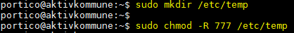
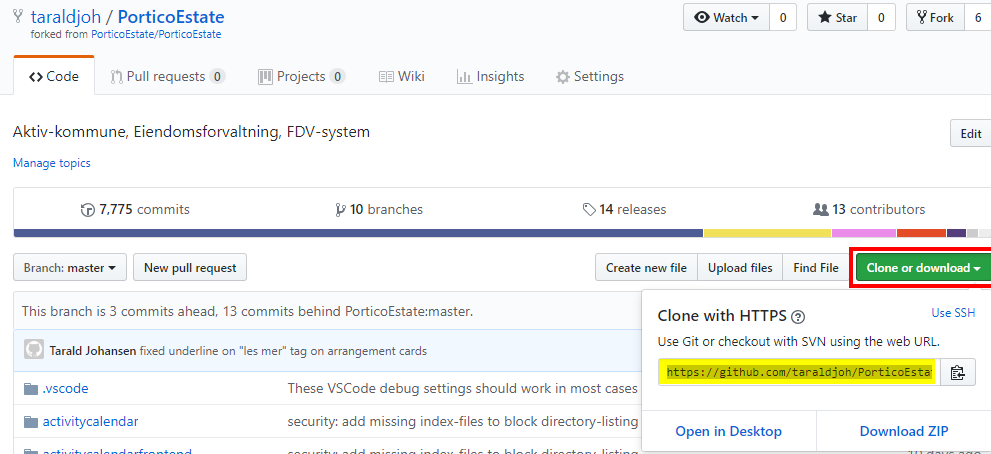
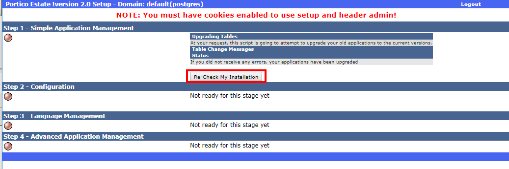

[[oppsett-av-utviklingsmiljø]]
= Oppsett av utviklingsmiljø
:toc: macro
:toc-title: Innhold

I dette dokumentet blir det vist steg for steg oppsettet av virtuelt utviklingsmiljø for Aktiv Kommune i Ålesund Kommune (som alternativ til vagrant), dette er _IKKE_ ment for miljø på lokale klienter. På slutten av dokumentet finner du en sjekkliste som må være fullført for at utviklingsmiljøet skal fungere som det skal.

toc::[]

[[oppsummering-av-miljøet]]
== Oppsummering av miljøet

Webserver kjøres virtuelt på vCenter/VMWare. Ubuntu server brukes for å konfigurere og kjøre webserveren + postgres database, og Visual Studio Code er applikasjonen som brukes som tekst editor for selve programmeringen og endringen i koden ved hjelp av SFTP tilkobling til serveren.

Selve git-operasjonene gjennomføres på Windows, enten via git sin egen cli eller annet tredjeparts program som GitHub Desktop eller GitKraken. Så lokal klone av koden blir dyttet til web-serveren via SFTP for å oppdatere koden som ligger der.

Miljøet er selvstendig, og kan derfor brukes av hvem som helst, så lenge de har passord til serveren/databasen og fork av masteren slik endringer i koden kan utføres og lagres. Miljøet er ikke avhengig av lokale klienter, og det blir tatt jevnlig backup slik at der ikke står noe risiko dersom noe galt skulle skje med serveren eller databasen.

[[verktøy]]
== Verktøy

Følgende verktøy blir brukt for å sette opp miljøet:

* Virtuell server lokalisert under Ålesund Kommune sitt VM Miljø i vCenter.
* Linux: Ubuntu (18.04.2) som får installert følgende:
** Apache2
** mySQL-client-core 5.7
** Git
** PostgreSQL
** PHP 7.4
** OpenSSH
* Uttak av database-data (databasedump) for import til serveren
* FileZilla

Du trenger også å forke koden fra GitHub. På GitHub ligger også dokumentasjon på hvilke kommandoer som kjøres på Ubuntu serveren for at alt skal virke som det skal.

Prosjekt Kode:

https://github.com/PorticoEstate[_https://github.com/PorticoEstate_]

Kommandoer dokumentasjon:

https://github.com/PorticoEstate/PorticoEstate/blob/master/phpgwapi/doc/Vagrantfile[_https://github.com/PorticoEstate/PorticoEstate/blob/master/phpgwapi/doc/Vagrantfile_]

[[del-1-oppsett-av-virtuell-server-i-vcentervmware]]
= Del 1: Oppsett av virtuell server i vCenter/VMWare

[[konfigurasjon-virtuell-server]]
== 1.1 Konfigurasjon virtuell server

1.  Start med å lag en blank VM. Serveren burde ha følgende spesifikasjoner for optimal ytelse.

[cols=",",options="header",]
|=============================================
|Lagringsplass |200GB
|CPU |2 Virtuelle sockets, 1 kjerne per socket
|RAM |2GB
|NIC’s |1
|=============================================

 +
 +
2.  Koble til Ubuntu ISO filen til den ny opprettede VM’en, skru på serveren, trykk «ESC» for å så boote på CD/DVD Drive. +
 +
 +
 +
 +
 +
 +
 +

[[del-2-installasjon-og-konfigurasjon-av-ubuntu-server.-1]]
= Del 2: Installasjon og konfigurasjon av Ubuntu server.

[[installasjon-av-ubuntu-server]]
== 2.1 Installasjon av Ubuntu server

1.  Velg språket du vil installere serveren på, og følg anvisningene videre for å starte installasjon.
2.  Når du kommer til «Profile Setup», anbefales det at du setter opp brukeren som følgende: +
 +
 +
Brukernavn: portico +
Passord: portico
3.  Velg «Install OpenSSH Server» på det neste steget. +

4.  Ikke velg noen «*Featured Server Snaps*» for å gjøre det enklest ved konfigurasjonsbiten.
5.  Installasjonen av Ubuntu server skal da starte. Det kan ta opptil 2 minutter før den er ferdig. Du vil bli bedt om å reboote serveren når installasjonen er ferdig.

Nå når serveren er ferdig installert, må vi installere en del ting for at alt skal fungere som det skal. Vi starter nå på del *2.2 – Konfigurasjon av Ubuntu Server.*

[[konfigurasjon-av-ubuntu-server]]
== 2.2 Konfigurasjon av Ubuntu Server

1.  Logg på serveren med brukernavnet og passordet.
2.  Før du gjør noe annet, kjør følgende kommandoer:
----
sudo apt-get update
sudo apt-get dist-upgrade
----
3. Installer pakker og opprett nødvendige tilganger ved å kjøre kommandoene under. De oppretter tilganger og riktig tilganger med hensyn til databasen: +
+
Kilde: https://github.com/PorticoEstate/PorticoEstate/blob/master/phpgwapi/doc/Vagrantfile[_https://github.com/PorticoEstate/PorticoEstate/blob/master/phpgwapi/doc/Vagrantfile_] +
[source,]
----
sudo apt-get install -y software-properties-common
sudo add-apt-repository -y ppa:ondrej/php
sudo apt-get update
sudo apt-get install -y apt-utils
sudo apt-get install -y apache2
sudo apt-get install -y mysql-client-core-8.0
sudo apt-get install -y libapache2-mod-php7.4 php7.4 php7.4-curl php7.4-intl php7.4-mysql php-xdebug php-apcu
php7.4-dev php7.4-xmlrpc php7.4-xml php7.4-gd php7.4-xsl php7.4-sybase php7.4-pgsql php7.4-json php7.4-gd php-imagick php7.4-imap php7.4-soap php7.4-zip php7.4-mbstring php-pear libaio1 locales

sudo apt-get install -y git
sudo apt-get install -y less vim-tiny
sudo apt-get install -y subversion
sudo apt-get install -y apg
sudo apt-get install -y openjdk-11-jre-headless
sudo sh -c 'echo "deb http://apt.postgresql.org/pub/repos/apt/ `lsb_release -cs`-pgdg main" >> /etc/apt/sources.list.d/pgdg.list'
wget -q https://www.postgresql.org/media/keys/ACCC4CF8.asc -O - | sudo apt-key add -
sudo apt-get update
sudo apt-get install -y postgresql-12 postgresql-client-12 postgresql-contrib-12
# fix permissions
echo "-------------------- fixing listen_addresses on postgresql.conf"
sudo sed -i "s/#listen_address.*/listen_addresses '*'/" /etc/postgresql/12/main/postgresql.conf

echo "-------------------- fixing postgres pg_hba.conf file"
# replace the ipv4 host line with the above line
sudo cat >> /etc/postgresql/12/main/pg_hba.conf <<EOF
# Accept all IPv4 connections - FOR DEVELOPMENT ONLY!!!
host    all         all         0.0.0.0/0             md5
EOF

echo "-------------------- creating postgres vagrant role with password vagrant"
# Create Role and login
sudo su postgres -c 'psql -c "CREATE ROLE vagrant SUPERUSER LOGIN PASSWORD '"'"'vagrant'"'"'" '
sudo su postgres -c 'psql -c "CREATE ROLE portico SUPERUSER LOGIN PASSWORD '"'"'portico'"'"'" '
sudo apt install -y whois
sudo useradd -p `mkpasswd "portico"` -d /home/"portico" -m -g users -s /bin/bash "portico"
sudo chmod 640 /etc/sudoers
sudo echo 'portico  ALL=(ALL:ALL) ALL' >> /etc/sudoers
sudo mkdir /var/www/html/portico
sudo chown portico.users /var/www/html/portico
sudo apt-get upgrade -y
sudo sed -i 's/"GP"/"GPCS"/' /etc/php/7.4/apache2/php.ini
sudo sed -i 's/"GP"/"GPCS"/' /etc/php/7.4/cli/php.ini
sudo cat > /etc/php/7.4/apache2/conf.d/91-app.ini <<EOF
xdebug.max_nesting_level=200
xdebug.overload_var_dump=Off
xdebug.remote_autostart=Off
xdebug.remote_connect_back=On
xdebug.remote_enable=On
xdebug.remote_port=9000
session.cookie_secure=Off
session.use_cookies=On
session.use_only_cookies=On
short_open_tag=Off
request_order = "GPCS"
variables_order = "GPCS"
memory_limit = 5048M
max_input_vars = 5000
error_reporting = E_ALL & ~E_NOTICE
display_errors = On
post_max_size = 20M
upload_max_filesize = 8M
EOF
 #   Edit the /etc/ssh/sshd_config file.
 #   Change PasswordAuthentication and ChallengeResponseAuthentication to yes.
 #   Restart ssh /etc/init.d/ssh restart.
sudo sed -i "s/PasswordAuthentication.*/PasswordAuthentication yes/" /etc/ssh/sshd_config
sudo sed -i "s/ChallengeResponseAuthentication.*/ChallengeResponseAuthentication yes/" /etc/ssh/sshd_config
sudo sed -i "s/PermitRootLogin.*/PermitRootLogin yes/" /etc/ssh/sshd_config
sudo service ssh restart
sudo cp /etc/php/7.4/apache2/conf.d/91-app.ini /etc/php/7.4/cli/conf.d/91-app.ini
# Enable mod_rewrite
sudo a2enmod rewrite
sudo service postgresql restart
sudo service apache2 restart

----

Etter dette er selve kjernekonfigurasjonen for Ubuntu ferdig. Vi går nå videre til opprettelsen og konfigurasjonen av selve databasen.

[[del-3-konfigurasjon-og-oppsett-av-database]]
= Del 3: Konfigurasjon og oppsett av database

[[opprette-postgresql-database-og-sette-rette-rettigheter]]
== 3.1 Opprette PostgreSQL database og sette rette rettigheter

1.  Gå inn på postgres uten å endre brukerkonto ved å gjøre som vist på bildet under. +
[source,]
----
 sudo -u postgres psql
----

 +
2.  Opprett databasen «_*portico*_» med eier «_*portico*_» ved å kjøre kommandoen under: +

[source,]
----
 CREATE DATABASE portico OWNER portico
----

Bekreft at databasen er opprettet med rett navn og eier ved å skrive

 \l

[IMPORTANT]
====
*NB! Husk å end alle kommandoer med «;»*
====

Med dette er databasen opprettet og klar for å motta database uttaket.

[[legge-databaseuttak-på-serveren-via-filezilla]]
== 3.2 Legge databaseuttak på serveren via FileZilla

Last ned FileZilla fra https://filezilla-project.org/[_https://filezilla-project.org/_]

Vi må bruke FileZilla for å overføre database-filen over på serveren slik den kan importeres til postgresql databasen vår.

1. Opprett en ny mappe med korrekte rettigheter på Ubuntu serveren. +
 +

Skriv kommandoen

 sudo mkdir /etc/temp

for å opprette mappene.
 +
 +
 +
2.  

Last opp databasefilen over på _*«/etc/temp»*_ mappen via FileZilla.
+
3.  Naviger deg inn på mappen databasefilen ligger på, og sjekk at filen «dbexportfile1.psql» ligger der. +
 +
4.  Mens du står inne på /etc/temp/DB/ - så skriver du kommandoen under for å importere database-filen på vår egen database.

 psql -U portico portico < dbexportfile1.psql

Importen er nå OK med mindre du fikk noen feilmeldinger, men da ble ikke alle stegene ovenfor fult i korrekt rekkefølge.
[NOTE]
====
Feilmeldinger relatert til manglende roller kan ignoreres
====

[[del-4-konfigurasjon-og-oppsett-av-prosjektet]]
= Del 4: Konfigurasjon og oppsett av prosjektet

[[klone-github-fork-til-serveren]]
== 4.1. Klone GitHub fork til serveren

1.  Naviger inn på mappen _«/var/www/html/»_ +

 +
 +
 +
2.  Hent fork URL’en fra Github og kopier denne. +
 +
3.  Kjør en git klone på servern, dette kan ta et minutt eller to. +

[[konfigurere-header]]
== 4.2 Konfigurere header

1.  Gå inn på en nettleser og skriv inn addressen til serveren etterfulgt av «PorticoEstate» +
 +

2.  Du skal nå komme inn på en konfigurasjonsside. +

3.  Bla til du finner feltene som vist på bildet under, og fyll inn slik det stemmer overens med det som er lagt inn som verdier. Trykk så «Download» +
 +
image:extracted-media/media/image18.png[image,width=519,height=295]
4.  Filen som ble lastet ned må vi laste opp på serveren. Dette må du bruke f.eks FileZilla til å gjøre. +

 +
Filen _*«header.inc.php»*_ skal flyttes inn til mappen _*«/var/www/html/portico/PorticoEstate» +
 +
5.  Når dette er gjort, kan du gå tilbake igjen i nettleseren og velge «Continue». Du skal da bli tatt til en login side som vist på bildet under. +

6.  Logg på med passordet «portico» som ble satt under konfigurasjonen av headeren og velg «Login». Du vil da bli tatt til siden som vist på bildet under. Trykk «Upgrade» knappen for å oppgradere all data/tables. +

7.  Bekreft ved å velge «Re-Check My Installation». Alle røde knapper som vist på bildet ovenfor til venstre skal nå være grønne, og du skal kunne trykke «Edit Current Configuration». +

8.  Sett path for temp filer og brukere/grupper til mappene vi opprettet tidligere, bla helt ned og lagre. +

9.  Trykk på «Manage Languages», sjekk at det er huket av for English og Norwegian -> Trykk Install +

10. Trykk så på «Manage Applications» +

11. Her må du huke av på «Upgrade» på «booking» og «property». Resten kan du ignorere,. Trykk så save for å lagre endringene. +

Konfigurasjonen er nå ferdig. Dersom du går inn på nettleseren, skriver in host-ip’en etterfulgt av \PorticoEstate\bookingfrontend\ så kommer du inn på nettsiden. +

Utviklingsmiljøet er nå satt opp. Det eneste som da gjenstår er å koble din ønsket teksteditor mot serveren, der endringene i GitHub skrives til serveren.

Jeg anbefaler å bruke Visual Studio Code. I del 5 tar jeg for hvordan du kan koble Visual Studio Code opp mot utviklermiljøet, og kan lagre endringer slik de skjer momentant direkte i nettleseren.

[[del-5-bruk-av-visual-studio-code-for-å-gjøre-endringer-1]]
= Del 5: Bruk av Visual Studio Code for å gjøre endringer

[[laste-ned-nødvendige-visual-studio-code-utvidelser]]
== 5.1 Laste ned nødvendige Visual Studio Code utvidelser

1.  Åpne Visual Studio Code. Trykk på «Extensions» knappen eller trykk «CTRL+SHIFT+X»
2.  Søk etter «SFTP» Trykk på første valget som vist på bildet og velg «Install» +

3.  Åpne forken du har hentet fra GitHub i Visual Studio Code, trykk «CTRL+SHIFT+P» Søk etter «SFTP:Config» og trykk «Enter» +

4.  I «sftp.json» filen må du endre name, host osv. slik de stemmer med din server, trykk «CTRL+S» for å lagre når du er ferdig. +

5.  Når dette er gjort, kan du gjøre endringer i koden Lagre Refreshe nettsiden +
 +
Da vil endringene ta effekt med engang, og når du skal pushe koden mot GitHub så gjør du det på klienten istedenfor på serveren. Siden denne SFTP’en skriver filene til serveren, vil filene der alltid være oppdatert. +
 +
Se gyazo gif link for å se at det fungerer.. +
 +
https://gyazo.com/df411f6bcac0083032ee73bff90d349b[_https://gyazo.com/df411f6bcac0083032ee73bff90d349b_]
